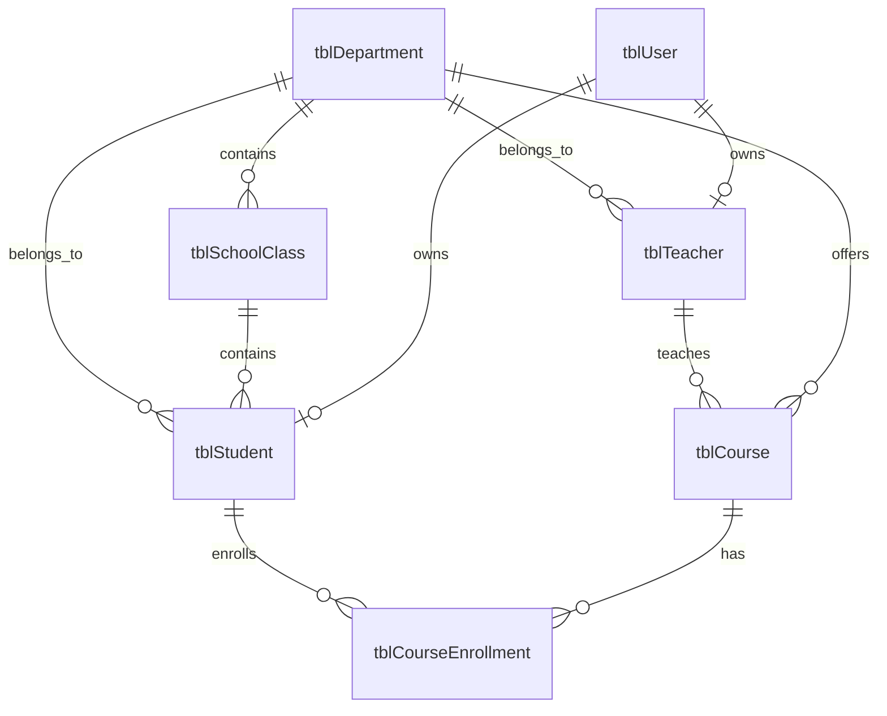

# vCampus 数据库设计说明

## 1. 设计约束

- 数据库为 Microsoft Access，服务端使用 UCanAccess 5.0.1 直接连接。
- 数据库默认路径为 `vcampus-database/vCampus.accdb`，不使用个人绝对路径。
- 表名采用 `tbl` 前缀，主键使用业务实体名加 `Id`，外键与被引用主键同名。
- 所有 SQL 使用 `PreparedStatement`，界面和客户端不得访问数据库。
- 数据库结构修改必须同时更新本文档和《数据库变更记录》。

## 2. 核心实体关系

学生和教师可以与登录账号一一关联；没有系统账号的历史学籍记录允许暂时不填写
`userId`。课程、借阅和订单等业务表只引用 `studentId` 或 `teacherId`，不得重复保存
学生姓名、班级等可由学籍表查询的数据。

## 3. 数据字典

### 3.1 tblUser

现有登录账号表，由用户与权限模块维护。`userId` 是学籍表关联登录身份的外键。

### 3.2 tblDepartment

| 字段 | Access 类型 | 约束 | 说明 |
| --- | --- | --- | --- |
| departmentId | TEXT(16) | 主键 | 院系编号 |
| departmentName | TEXT(64) | 非空、唯一 | 院系名称 |
| description | TEXT(255) | 可空 | 简介 |
| active | YESNO | 非空 | 是否启用 |

### 3.3 tblSchoolClass

| 字段 | Access 类型 | 约束 | 说明 |
| --- | --- | --- | --- |
| classId | TEXT(20) | 主键 | 班级编号 |
| className | TEXT(64) | 非空、唯一 | 班级名称 |
| departmentId | TEXT(16) | 外键、非空 | 所属院系 |
| gradeYear | INTEGER | 非空 | 入学年级 |
| counselor | TEXT(64) | 可空 | 辅导员姓名 |
| active | YESNO | 非空 | 是否启用 |

### 3.4 tblStudent

| 字段 | Access 类型 | 约束 | 说明 |
| --- | --- | --- | --- |
| studentId | TEXT(20) | 主键 | 学号 |
| userId | TEXT(32) | 外键、可空、唯一 | 登录账号 |
| fullName | TEXT(64) | 非空 | 姓名 |
| genderName | TEXT(16) | 非空 | 性别 |
| birthDate | TEXT(10) | 可空 | 出生日期，固定 `yyyy-MM-dd` 格式 |
| departmentId | TEXT(16) | 外键、非空 | 所属院系 |
| classId | TEXT(20) | 外键、非空 | 所属班级 |
| enrollmentYear | INTEGER | 非空 | 入学年份 |
| statusName | TEXT(16) | 非空 | 在读、休学、毕业或退学 |
| phone | TEXT(24) | 可空 | 电话 |
| email | TEXT(128) | 可空 | 邮箱 |

### 3.5 tblTeacher

| 字段 | Access 类型 | 约束 | 说明 |
| --- | --- | --- | --- |
| teacherId | TEXT(20) | 主键 | 工号 |
| userId | TEXT(32) | 外键、可空、唯一 | 登录账号 |
| fullName | TEXT(64) | 非空 | 姓名 |
| departmentId | TEXT(16) | 外键、非空 | 所属院系 |
| titleName | TEXT(32) | 可空 | 职称 |
| phone | TEXT(24) | 可空 | 电话 |
| email | TEXT(128) | 可空 | 邮箱 |
| active | YESNO | 非空 | 是否在岗 |

### 3.6 tblCourse

| 字段 | Access 类型 | 约束 | 说明 |
| --- | --- | --- | --- |
| courseId | TEXT(20) | 主键 | 课程编号 |
| courseName | TEXT(64) | 非空 | 课程名称 |
| teacherId | TEXT(20) | 外键、非空 | 授课教师工号 |
| departmentId | TEXT(16) | 外键、非空 | 开课院系 |
| credit | DOUBLE | 非空 | 学分 |
| capacity | INTEGER | 非空 | 选课容量 |
| semesterName | TEXT(32) | 非空 | 开课学期 |
| classTime | TEXT(64) | 非空 | 上课时间，用于冲突校验 |
| location | TEXT(64) | 可空 | 上课地点 |
| description | TEXT(255) | 可空 | 课程简介 |
| active | YESNO | 非空 | 是否开放选课 |

### 3.7 tblCourseEnrollment

| 字段 | Access 类型 | 约束 | 说明 |
| --- | --- | --- | --- |
| enrollmentId | TEXT(32) | 主键 | 选课记录编号，服务端生成 |
| studentId | TEXT(20) | 外键、非空 | 选课学生学号 |
| courseId | TEXT(20) | 外键、非空 | 所选课程编号 |
| enrollTime | TEXT(19) | 非空 | 选课时间，固定 `yyyy-MM-dd HH:mm:ss` |

`tblCourseEnrollment` 对 `(courseId, studentId)` 建有唯一约束，从数据库层面阻止同一
学生重复选择同一门课程。选课时间采用受控文本格式，与服务端生成的
`LocalDateTime` 保持一致，避免不同机房对 Access 日期时间类型的处理差异。

## 4. 权限规则

| 角色 | 查询范围 | 修改权限 |
| --- | --- | --- |
| ADMIN | 全部学籍数据 | 可维护学生、教师、班级和院系 |
| TEACHER | 全部学籍数据 | 默认只读 |
| STUDENT | 仅本人学籍、班级和院系 | 只读 |

客户端只负责隐藏无权操作的按钮；服务端必须再次验证会话和角色。

## 5. 删除与一致性规则

- 已被班级、学生或教师引用的院系不得删除，应先停用。
- 已有学生的班级不得删除，应先停用。
- 删除学生或教师前，各业务模块应检查选课、借阅、订单等引用。
- 班级所属院系必须与学生所属院系一致。
- 学号、工号、院系名称和班级名称不得重复。
- 已被选课记录引用的课程不得删除，应先停用。
- 删除学生或教师时，选课记录的外键约束会阻止删除，服务端将其转换为 `CONFLICT`。

出生日期采用格式受控的文本字段，是为了避免不同机房 Access/Jackcess 版本对日期时间
内部类型的转换差异；服务端使用 Java 8 `LocalDate` 完成合法性校验。
