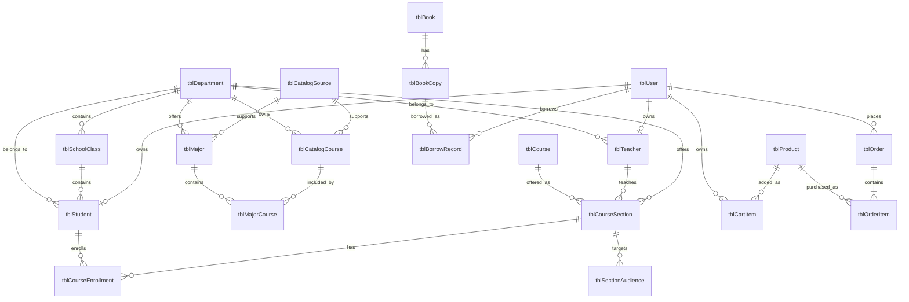

# vCampus 数据库设计说明

## 1. 设计约束

- 数据库为 Microsoft Access，服务端使用 UCanAccess 5.0.1 直接连接。
- 数据库默认路径为 `vcampus-database/vCampus.accdb`，不使用个人绝对路径。
- 表名采用 `tbl` 前缀，主键使用业务实体名加 `Id`，外键与被引用主键同名。
- 所有 SQL 使用 `PreparedStatement`，界面和客户端不得访问数据库。
- 数据库结构修改必须同时更新本文档和《数据库变更记录》。

## 2. 核心实体关系

学生和教师可以与登录账号一一关联；没有系统账号的历史学籍记录允许暂时不填写
`userId`。课程、借阅和订单等业务表不要重复保存学生姓名、班级等可由学籍表查询的数据。
账号的全局授权角色不作为学生或教师身份字段；学籍身份由 `tblStudent`、`tblTeacher`
及其 `userId` 关系表达，避免业务模块反向判断全局角色。
图书馆借阅记录统一引用登录账号 `userId`，从而同时支持学生和教师借阅；
需要学籍信息时，再通过 `tblStudent.userId` 或 `tblTeacher.userId` 关联查询。
购物车和订单同样引用 `tblUser.userId`，避免使用姓名或学号作为跨模块身份。
`tblCatalogCourse` 是带官网来源、学时和建议修读学期的公开培养方案快照；`tblCourse`
是选课模块维护的精简课程目录；`tblCourseSection` 才是当前可选的实际教学班。
三者用途不同，不直接混用；容量、教师、时间和选课窗口都归教学班维护。

## 3. 数据字典

### 3.1 tblUser

现有登录账号表，由用户与权限模块维护。`userId` 是学籍表关联登录身份的外键。

### 3.2 tblDepartment

| 字段 | Access 类型 | 约束 | 说明 |
| --- | --- | --- | --- |
| departmentId | TEXT(16) | 主键 | 院系编号 |
| departmentName | TEXT(64) | 非空、唯一 | 院系名称 |
| description | TEXT(255) | 可空 | 简介 |
| active | YESNO | 非空 | 是否启用 |
| homepageUrl | TEXT(255) | 可空 | 院系官网地址 |
| sourceUrl | TEXT(255) | 可空 | 院系列表来源页 |
| collectedAt | TEXT(10) | 可空 | 快照采集日期，`yyyy-MM-dd` |

### 3.3 tblSchoolClass

| 字段 | Access 类型 | 约束 | 说明 |
| --- | --- | --- | --- |
| classId | TEXT(20) | 主键 | 班级编号 |
| className | TEXT(64) | 非空、唯一 | 班级名称 |
| departmentId | TEXT(16) | 外键、非空 | 所属院系 |
| gradeYear | INTEGER | 非空 | 入学年级 |
| counselor | TEXT(64) | 可空 | 辅导员姓名 |
| capacity | INTEGER | 非空、正整数 | 班级容量，旧库升级时默认为 50 |
| active | YESNO | 非空 | 是否启用 |

### 3.4 tblStudent

| 字段 | Access 类型 | 约束 | 说明 |
| --- | --- | --- | --- |
| studentId | TEXT(20) | 主键 | 学号 |
| userId | TEXT(32) | 外键、可空、唯一 | 登录账号 |
| fullName | TEXT(64) | 非空 | 姓名 |
| genderName | TEXT(16) | 非空 | 性别 |
| birthDate | TEXT(10) | 可空 | 出生日期，固定 `yyyy-MM-dd` 格式 |
| departmentId | TEXT(16) | 外键、非空 | 所属院系 |
| classId | TEXT(20) | 外键、非空 | 所属班级 |
| enrollmentYear | INTEGER | 非空 | 入学年份 |
| statusName | TEXT(16) | 非空 | 在读、休学、毕业或退学 |
| phone | TEXT(24) | 可空 | 电话 |
| email | TEXT(128) | 可空 | 邮箱 |

### 3.5 tblTeacher

| 字段 | Access 类型 | 约束 | 说明 |
| --- | --- | --- | --- |
| teacherId | TEXT(20) | 主键 | 工号 |
| userId | TEXT(32) | 外键、可空、唯一 | 登录账号 |
| fullName | TEXT(64) | 非空 | 姓名 |
| departmentId | TEXT(16) | 外键、非空 | 所属院系 |
| titleName | TEXT(32) | 可空 | 职称 |
| phone | TEXT(24) | 可空 | 电话 |
| email | TEXT(128) | 可空 | 邮箱 |
| active | YESNO | 非空 | 是否在岗 |

### 3.6 tblCourse（课程目录）

| 字段 | Access 类型 | 约束 | 说明 |
| --- | --- | --- | --- |
| courseId | TEXT(20) | 主键 | 课程编号 |
| courseName | TEXT(64) | 非空 | 课程名称 |
| credit | DOUBLE | 非空 | 学分 |
| description | TEXT(255) | 可空 | 课程简介 |
| active | YESNO | 非空 | 是否开放选课 |

课程目录只描述“这门课是什么”，不保存具体开课信息。

### 3.7 tblCourseSection（教学班 / 开课记录）

| 字段 | Access 类型 | 约束 | 说明 |
| --- | --- | --- | --- |
| sectionId | TEXT(24) | 主键 | 教学班编号 |
| courseId | TEXT(20) | 外键、非空 | 所属课程 |
| teacherId | TEXT(20) | 外键、非空 | 授课教师工号 |
| departmentId | TEXT(16) | 外键、非空 | 开课院系 |
| semesterName | TEXT(32) | 非空 | 开课学期 |
| classTime | TEXT(64) | 非空 | 上课时间，用于冲突校验 |
| location | TEXT(64) | 可空 | 上课地点 |
| capacity | INTEGER | 非空 | 选课容量 |
| courseNature | TEXT(16) | 非空 | 必修 / 限选 / 任选 / 通选 |
| selectionStartTime | TEXT(16) | 可空 | 选课开始，`yyyy-MM-dd HH:mm` |
| selectionEndTime | TEXT(16) | 可空 | 选课结束，`yyyy-MM-dd HH:mm` |
| active | YESNO | 非空 | 管理员是否发布或停用 |

### 3.8 tblSectionAudience（教学班受众）

| 字段 | Access 类型 | 约束 | 说明 |
| --- | --- | --- | --- |
| audienceId | TEXT(32) | 主键 | 受众规则编号 |
| sectionId | TEXT(24) | 外键、非空 | 所属教学班 |
| scopeType | TEXT(12) | 非空 | `ALL` 或 `DEPARTMENT` |
| scopeValue | TEXT(16) | 可空 | 非 `ALL` 时的院系编号 |
| yearMin | INTEGER | 可空 | 入学年份下限 |
| yearMax | INTEGER | 可空 | 入学年份上限 |

受众规则取并集：满足任意一条规则的在读学生可见并可选该教学班。选课模块不引入专业
维度，受众粒度到“全校 / 院系 × 入学年份区间”。

### 3.9 tblCourseEnrollment（选课记录）

| 字段 | Access 类型 | 约束 | 说明 |
| --- | --- | --- | --- |
| enrollmentId | TEXT(32) | 主键 | 选课记录编号，服务端生成 |
| studentId | TEXT(20) | 外键、非空 | 选课学生学号 |
| sectionId | TEXT(24) | 外键、非空 | 所选教学班编号 |
| enrollTime | TEXT(19) | 非空 | 选课时间，固定 `yyyy-MM-dd HH:mm:ss` |

`tblCourseEnrollment` 对 `(sectionId, studentId)` 建有唯一约束；服务端另按课程编号
禁止同一学生选择同一门课的不同教学班。选课时间采用受控文本格式，与服务端生成的
`LocalDateTime` 保持一致，避免不同机房对 Access 日期时间类型的处理差异。

### 3.10 tblBook

| 字段 | Access 类型 | 约束 | 说明 |
| --- | --- | --- | --- |
| isbn | TEXT(32) | 主键 | 国际标准书号 |
| title | TEXT(128) | 非空 | 书名 |
| author | TEXT(64) | 非空 | 作者 |
| publisher | TEXT(64) | 可空 | 出版社 |
| category | TEXT(32) | 可空 | 分类 |
| active | YESNO | 非空 | 是否在架检索 |

### 3.11 tblBookCopy

| 字段 | Access 类型 | 约束 | 说明 |
| --- | --- | --- | --- |
| copyId | COUNTER | 主键 | 副本编号 |
| isbn | TEXT(32) | 非空 | 所属书目 |
| copyStatus | TEXT(16) | 非空 | `AVAILABLE` 或 `BORROWED` |

### 3.12 tblBorrowRecord

| 字段 | Access 类型 | 约束 | 说明 |
| --- | --- | --- | --- |
| recordId | COUNTER | 主键 | 借阅记录编号 |
| copyId | LONG | 非空 | 借出的副本 |
| userId | TEXT(32) | 外键、非空 | 借阅人登录账号，引用 `tblUser.userId` |
| borrowTime | TEXT(19) | 非空 | 借出时间，固定 `yyyy-MM-dd HH:mm:ss` |
| dueTime | TEXT(19) | 非空 | 应还时间，固定 `yyyy-MM-dd HH:mm:ss` |
| returnTime | TEXT(19) | 可空 | 实际归还时间，空值表示在借 |

### 3.13 tblCatalogSource

| 字段 | Access 类型 | 约束 | 说明 |
| --- | --- | --- | --- |
| sourceId | TEXT(20) | 主键 | 稳定的来源编号 |
| sourceType | TEXT(16) | 非空 | 院系列表或培养方案 |
| title | TEXT(128) | 非空 | 官方页面或附件标题 |
| sourceYear | INTEGER | 非空 | 来源对应年份 |
| sourceUrl | TEXT(255) | 非空 | 东南大学官方来源地址 |
| collectedAt | TEXT(10) | 非空 | 快照采集日期 |

### 3.14 tblMajor

| 字段 | Access 类型 | 约束 | 说明 |
| --- | --- | --- | --- |
| majorId | TEXT(16) | 主键 | 教育部专业代码 |
| departmentId | TEXT(16) | 外键、非空 | 所属院系 |
| majorName | TEXT(64) | 非空 | 专业名称 |
| degreeType | TEXT(16) | 非空 | 学位类型 |
| durationYears | INTEGER | 非空 | 标准学制 |
| sourceYear | INTEGER | 非空 | 培养方案年份 |
| sourceId | TEXT(20) | 外键、非空 | 来源记录 |
| sourceUrl | TEXT(255) | 非空 | 官方培养方案地址 |
| active | YESNO | 非空 | 是否启用 |

### 3.15 tblCatalogCourse

| 字段 | Access 类型 | 约束 | 说明 |
| --- | --- | --- | --- |
| courseId | TEXT(20) | 主键 | 官方培养方案课程编号 |
| departmentId | TEXT(16) | 外键、非空 | 课程归属院系 |
| courseName | TEXT(128) | 非空 | 课程名称 |
| credits | DOUBLE | 非空 | 学分 |
| lectureHours | INTEGER | 非空 | 授课学时 |
| practiceHours | INTEGER | 非空 | 实验或实践学时 |
| courseType | TEXT(32) | 非空 | 学科基础、专业主干或专业选修等 |
| sourceYear | INTEGER | 非空 | 培养方案年份 |
| sourceId | TEXT(20) | 外键、非空 | 来源记录 |
| sourceUrl | TEXT(255) | 非空 | 官方培养方案地址 |
| active | YESNO | 非空 | 是否启用 |

### 3.16 tblMajorCourse

| 字段 | Access 类型 | 约束 | 说明 |
| --- | --- | --- | --- |
| majorId | TEXT(16) | 联合主键、外键 | 专业 |
| courseId | TEXT(20) | 联合主键、外键 | 课程 |
| recommendedYear | INTEGER | 非空 | 建议修读学年 |
| recommendedSemester | INTEGER | 非空 | 建议修读学期（1、2 或 3） |
| required | YESNO | 非空 | 是否为该专业必修 |

### 3.17 tblProduct

| 字段 | Access 类型 | 约束 | 说明 |
| --- | --- | --- | --- |
| productId | TEXT(20) | 主键 | 商品编号 |
| productName | TEXT(64) | 非空、唯一 | 商品名称 |
| category | TEXT(32) | 可空 | 分类 |
| description | TEXT(255) | 可空 | 商品说明 |
| price | CURRENCY | 非空 | 单价 |
| stock | INTEGER | 非空 | 当前库存 |
| active | YESNO | 非空 | 是否上架 |

### 3.18 tblCartItem

| 字段 | Access 类型 | 约束 | 说明 |
| --- | --- | --- | --- |
| cartItemId | TEXT(40) | 主键 | 购物车行编号 |
| userId | TEXT(32) | 外键、非空 | 所属账号，引用 `tblUser.userId` |
| productId | TEXT(20) | 外键、非空 | 商品编号 |
| quantity | INTEGER | 非空 | 数量 |

`tblCartItem` 对 `(userId, productId)` 建有唯一约束。

### 3.19 tblOrder

| 字段 | Access 类型 | 约束 | 说明 |
| --- | --- | --- | --- |
| orderId | TEXT(40) | 主键 | 订单编号 |
| userId | TEXT(32) | 外键、非空 | 下单账号，引用 `tblUser.userId` |
| totalAmount | CURRENCY | 非空 | 订单总额 |
| statusName | TEXT(16) | 非空 | 订单状态 |
| orderTime | TEXT(19) | 非空 | 下单时间，`yyyy-MM-dd HH:mm:ss` |

### 3.20 tblOrderItem

| 字段 | Access 类型 | 约束 | 说明 |
| --- | --- | --- | --- |
| orderItemId | TEXT(40) | 主键 | 订单明细编号 |
| orderId | TEXT(40) | 外键、非空 | 所属订单 |
| productId | TEXT(20) | 外键、非空 | 商品编号 |
| productName | TEXT(64) | 非空 | 下单时商品名称快照 |
| unitPrice | CURRENCY | 非空 | 下单时单价快照 |
| quantity | INTEGER | 非空 | 购买数量 |
| subtotal | CURRENCY | 非空 | 行金额 |

## 4. 权限规则

| 角色 | 查询范围 | 修改权限 |
| --- | --- | --- |
| 管理员（当前学籍子系统有效角色） | 全部学籍数据 | 可维护学生、教师、班级和院系 |
| 教师（当前学籍子系统有效角色） | 全部学籍数据 | 默认只读 |
| 学生（当前学籍子系统有效角色） | 仅本人学籍；可浏览专业与培养方案目录 | 只读 |

全局账号角色和管理范围由分发层转换为当前子系统有效角色；业务模块不得直接根据
`SUPER_ADMIN` 或 `SUBSYSADMIN` 判断权限。客户端只负责隐藏无权操作的按钮，服务端
仍须验证会话、有效角色和数据范围。

## 5. 删除与一致性规则

- 已被班级、学生、教师、专业、目录课程或实际课程引用的院系不得删除，应先停用。
- 已有学生的班级不得删除，应先停用。
- 有选课记录的学生不得删除；有授课课程的教师不得删除。
- 班级所属院系必须与学生所属院系一致。
- 自动分班按学院与入学年份筛选启用班级，仅选择当前人数小于 `capacity` 的班级，并优先分配到人数最少的班级。
- 学生只能自行修改本人 `genderName`、`birthDate`、`phone` 和 `email`，其余学籍字段由管理员维护。
- 学号、工号、院系名称和班级名称不得重复。
- 仍有选课记录引用的教学班不得删除，应先停用；删除教学班时级联清理其受众规则。
- 同门课程的受众、容量、上课时间、选课窗口属于教学班，编辑时互不影响其他教学班。
- 仍有在借副本或借阅记录的图书不得删除，应先下架；馆藏册数不能少于当前在借数量。
- 学籍服务在删除前主动检查跨模块引用并返回 `CONFLICT`，数据库外键作为第二层保护。
- 购物车和订单只能引用已存在的登录账号；旧数据库启动时自动补齐用户外键。

出生日期采用格式受控的文本字段，是为了避免不同机房 Access/Jackcess 版本对日期时间
内部类型的转换差异；服务端使用 Java 8 `LocalDate` 完成合法性校验。
