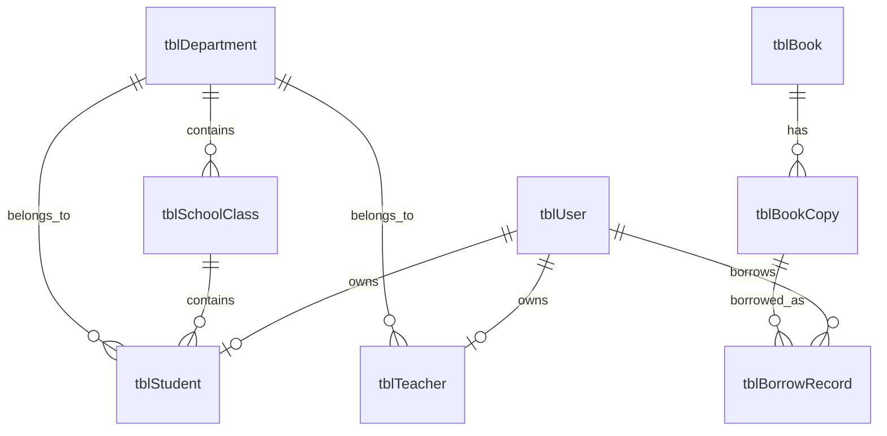

# vCampus 数据库设计说明

## 1. 设计约束

- 数据库为 Microsoft Access，服务端使用 UCanAccess 5.0.1 直接连接。
- 数据库默认路径为 `vcampus-database/vCampus.accdb`，不使用个人绝对路径。
- 表名采用 `tbl` 前缀，主键使用业务实体名加 `Id`，外键与被引用主键同名。
- 所有 SQL 使用 `PreparedStatement`，界面和客户端不得访问数据库。
- 数据库结构修改必须同时更新本文档和《数据库变更记录》。

## 2. 核心实体关系

学生和教师可以与登录账号一一关联；没有系统账号的历史学籍记录允许暂时不填写
`userId`。课程、借阅和订单等业务表不要重复保存学生姓名、班级等可由学籍表查询的数据。
账号的全局授权角色不作为学生或教师身份字段；学籍身份由 `tblStudent`、`tblTeacher`
及其 `userId` 关系表达，避免业务模块反向判断全局角色。
图书馆借阅记录统一引用登录账号 `userId`，从而同时支持学生、教师和管理员借阅；
需要学籍信息时，再通过 `tblStudent.userId` 或 `tblTeacher.userId` 关联查询。

## 3. 数据字典

### 3.1 tblUser

现有登录账号表，由用户与权限模块维护。`userId` 是学籍表关联登录身份的外键。

### 3.2 tblDepartment

| 字段 | Access 类型 | 约束 | 说明 |
| --- | --- | --- | --- |
| departmentId | TEXT(16) | 主键 | 院系编号 |
| departmentName | TEXT(64) | 非空、唯一 | 院系名称 |
| description | TEXT(255) | 可空 | 简介 |
| active | YESNO | 非空 | 是否启用 |

### 3.3 tblSchoolClass

| 字段 | Access 类型 | 约束 | 说明 |
| --- | --- | --- | --- |
| classId | TEXT(20) | 主键 | 班级编号 |
| className | TEXT(64) | 非空、唯一 | 班级名称 |
| departmentId | TEXT(16) | 外键、非空 | 所属院系 |
| gradeYear | INTEGER | 非空 | 入学年级 |
| counselor | TEXT(64) | 可空 | 辅导员姓名 |
| active | YESNO | 非空 | 是否启用 |

### 3.4 tblStudent

| 字段 | Access 类型 | 约束 | 说明 |
| --- | --- | --- | --- |
| studentId | TEXT(20) | 主键 | 学号 |
| userId | TEXT(32) | 外键、可空、唯一 | 登录账号 |
| fullName | TEXT(64) | 非空 | 姓名 |
| genderName | TEXT(16) | 非空 | 性别 |
| birthDate | TEXT(10) | 可空 | 出生日期，固定 `yyyy-MM-dd` 格式 |
| departmentId | TEXT(16) | 外键、非空 | 所属院系 |
| classId | TEXT(20) | 外键、非空 | 所属班级 |
| enrollmentYear | INTEGER | 非空 | 入学年份 |
| statusName | TEXT(16) | 非空 | 在读、休学、毕业或退学 |
| phone | TEXT(24) | 可空 | 电话 |
| email | TEXT(128) | 可空 | 邮箱 |

### 3.5 tblTeacher

| 字段 | Access 类型 | 约束 | 说明 |
| --- | --- | --- | --- |
| teacherId | TEXT(20) | 主键 | 工号 |
| userId | TEXT(32) | 外键、可空、唯一 | 登录账号 |
| fullName | TEXT(64) | 非空 | 姓名 |
| departmentId | TEXT(16) | 外键、非空 | 所属院系 |
| titleName | TEXT(32) | 可空 | 职称 |
| phone | TEXT(24) | 可空 | 电话 |
| email | TEXT(128) | 可空 | 邮箱 |
| active | YESNO | 非空 | 是否在岗 |

### 3.6 tblBook

| 字段 | Access 类型 | 约束 | 说明 |
| --- | --- | --- | --- |
| isbn | TEXT(32) | 主键 | 国际标准书号 |
| title | TEXT(128) | 非空 | 书名 |
| author | TEXT(64) | 非空 | 作者 |
| publisher | TEXT(64) | 可空 | 出版社 |
| category | TEXT(32) | 可空 | 分类 |
| active | YESNO | 非空 | 是否在架检索 |

### 3.7 tblBookCopy

| 字段 | Access 类型 | 约束 | 说明 |
| --- | --- | --- | --- |
| copyId | COUNTER | 主键 | 副本编号 |
| isbn | TEXT(32) | 非空 | 所属书目 |
| copyStatus | TEXT(16) | 非空 | `AVAILABLE` 或 `BORROWED` |

### 3.8 tblBorrowRecord

| 字段 | Access 类型 | 约束 | 说明 |
| --- | --- | --- | --- |
| recordId | COUNTER | 主键 | 借阅记录编号 |
| copyId | LONG | 非空 | 借出的副本 |
| userId | TEXT(32) | 外键、非空 | 借阅人登录账号，引用 `tblUser.userId` |
| borrowTime | DATETIME | 非空 | 借出时间 |
| dueTime | DATETIME | 非空 | 应还时间 |
| returnTime | DATETIME | 可空 | 实际归还时间，空值表示在借 |

## 4. 权限规则

| 角色 | 查询范围 | 修改权限 |
| --- | --- | --- |
| 管理员（当前学籍子系统有效角色） | 全部学籍数据 | 可维护学生、教师、班级和院系 |
| 教师（当前学籍子系统有效角色） | 全部学籍数据 | 默认只读 |
| 学生（当前学籍子系统有效角色） | 仅本人学籍、班级和院系 | 只读 |

全局账号角色和管理范围由分发层转换为当前子系统有效角色；业务模块不得直接根据
`SUPER_ADMIN` 或 `SUBSYSADMIN` 判断权限。客户端只负责隐藏无权操作的按钮，服务端
仍须验证会话、有效角色和数据范围。

## 5. 删除与一致性规则

- 已被班级、学生或教师引用的院系不得删除，应先停用。
- 已有学生的班级不得删除，应先停用。
- 删除学生或教师前，各业务模块应检查选课、借阅、订单等引用。
- 班级所属院系必须与学生所属院系一致。
- 学号、工号、院系名称和班级名称不得重复。

出生日期采用格式受控的文本字段，是为了避免不同机房 Access/Jackcess 版本对日期时间
内部类型的转换差异；服务端使用 Java 8 `LocalDate` 完成合法性校验。
